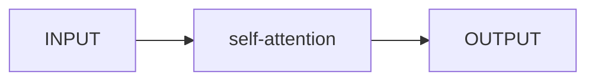

### Sequence as Input
#### Self-attention
    易小鱼 2023 Summer
#### 什么样的Input？什么样的Output？
截至目前位置，我们的输入都是单个向量，无论是全连接网络，卷积神经网络（把图像经过卷积后变成一个向量），input is a single vector，然后输出一个标量。
 But what if input is a set of vectors? For instance, 输入是一段文字（把每个字看成一个向量(by one-hot,word embedding,etc)、一段声音讯号、一个Graph, etc.
 会有何种输出？
 1. 每个vector对应一个scalar,输出一个跟输入序列长度相同的vector。例子：输入一段文字，用神经网络对其做词性标注。
 2. The whole sequence has a label.例如：输入一段话，输出该段话的情感。
 3. Model decides the number of labels itself. 即seq2seq.例如：翻译。

我们先看情况1，称作Sequence labeling
#### 直接套用fully connected network不好吗？
我们要解决的任务是，输入一个向量序列$\alpha_1,\dots,\alpha_n$,输出一个序列$\hat{y}_1,\dots,\hat{y}_n$,那直接训练一个fully connected network,然后依次从1到n丢进去得到预测结果，不就好了吗？存在什么问题？

没有考虑序列带来的上下文关系！在实际问题中，序列往往比单个向量的输入蕴含了更多的信息。比如说同一个单词"like",在不同语境中可以做动词表示喜爱，也可以做名词表示社交平台上的点赞，那如果是一个词性标注的任务，用上述的办法，同一个输入like不会得到不同的输出结果，这与我们想要的情况是不相符的。

哪怕我们真的要用fcNN,理想的情况应当是，即便是序列中相同的向量，他们作为fcNN的输入，也应当是不同的，并且这种不同要蕴含序列带来的信息。

**这启示我们，when sequence as input, we need to focus on the context!**

但是如何在上下文中学到有用的信息？又如何把我们的input与这些信息结合在一起？

#### self-attention技术！
我们所期望的：输入input$\alpha_1,...,\alpha_n$，经过某种变换，得到输出output$\beta_1,...,\beta_n$,并且这个output是蕴含了序列context带来的信息的。
那么我们就可以把$\beta_1,...,\beta_n$丢进fcNN,并得到结果。
值得一提的是，这里的$\alpha_1,...,\alpha_n$不一定要是最初的input sequence，也可以是fcNN输出的sequence，可以是任何的序列！
过程如下图：

但是我们还没有解决最关键的问题，到底是靠什么去获取序列context所蕴含的信息！

根据我们的先验知识，可以合理假设，序列的上下文应该是在某种意义上相关的，并且序列中不同的向量之间这种相关的程度是不同的，那么一个自然的思路是，把这种相关程度作为权重，将对应的向量加权求和，作为原向量考虑过sequence context之后的输出。

那么如何衡量这种相关程度呢？我们可以通过query-keys查找的办法实现，具体如下。

$q_i=W^q\alpha_i,k_i=W^k\alpha_i$,得到每个向量对应的query和key，并定义内积$r_{ij}=q_i^Tk_j$作为衡量$\alpha_i,\alpha_j$之间的相似程度。

现在考虑对某个$\alpha_i$,我们通过上面的方式得到了他跟所有向量之间的相似程度$r_{i1},...,r_{in}$，一般来说我们会对相似程度进行softmax归一化得到$\hat{r_{i1}},...,\hat{r_{in}}$.

得到第i个向量跟每个向量的相关程度以后，我们对每一个向量进行加权求和作为第i个向量的输出。注意此处在加权求和时不是直接对原向量进行加权求和，而是先左乘一个矩阵$v_i=W^v\alpha_i$作为其value，并把value加权求和，得到第i个output$\beta_i=\sum_{j=1}^n\hat{r_{ij}}v_j$

将上述过程写成矩阵运算的形式
记
$$
I=(\alpha_1,...,\alpha_n) \text{ input matrix}\\
O=(\beta_1,...,\beta_n)\text{ output matrix}\\
Q=(q_1,...,q_n)=W^qI\\
K=(k_1,...,k_n)=W^kI\\
V=(v_1,...,v_n)=W^vI
$$
把相关程度attention matrix记作
$$
A=K^TQ
$$
经过softmax后得到
$$
A'=softmax(A)
$$
那么就有
$$
O=VA'
$$

在上面的过程里，$W^q,W^k,W^v$三个矩阵是待学习的参数！不同意义下的“相关”所对应的这三个矩阵应当是不同的！

#### Multi-head attention
上文中提到“不同意义下的‘相关’”，也就是说可以有多头的注意力！
不妨假定有m个头的注意力，也就是有$W^q_1,W^k_1,W^v_1,...,W^q_m,W^k_m,W^v_m$这些相应的矩阵。
对于第l个头，我们按上面的方法得到其输出矩阵$O_l$,然后我们把m个输出矩阵拼起来。就像：
$$
\left(
\begin{matrix}
    O_1\\
    O_2\\
    \vdots\\
    O_m
\end{matrix}
\right)
$$
然后左乘上一个矩阵得到
$$
O=
W^o\left(
\begin{matrix}
    O_1\\
    O_2\\
    \vdots\\
    O_m
\end{matrix}
\right)
$$
$O$的每一列就分别是$\alpha$综合了多头注意力后所对应的输出！

